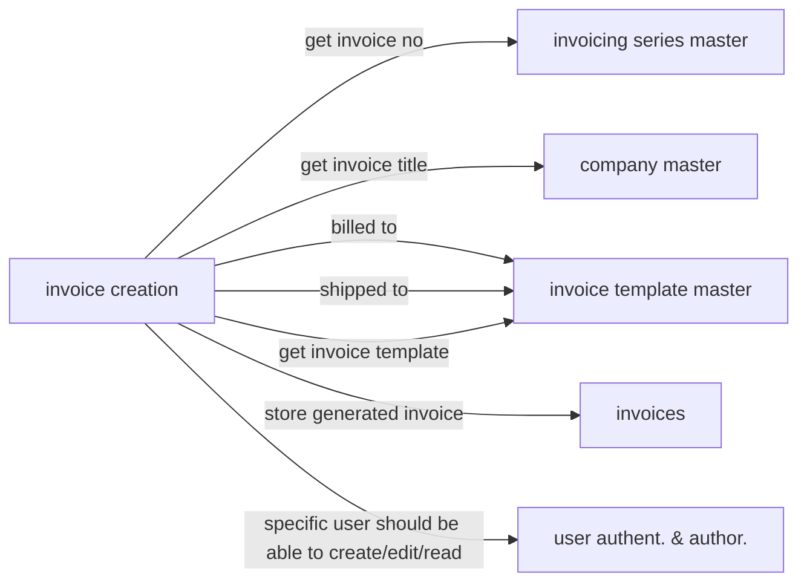

```mermaid
flowchart LR
  a[invoice creation] -->|get invoice no| b[invoicing series master]
  a -->|get invoice title| c[company master]
  a -->|billed to | d[company unit master]
  a -->|shipped to | d[company unit master]
  a -->|get invoice template| d[invoice template master]
  a -->|store generated invoice| e[invoices]
  a -->|specific user should be able to create/edit/read| f[user authent. & author.]
```
