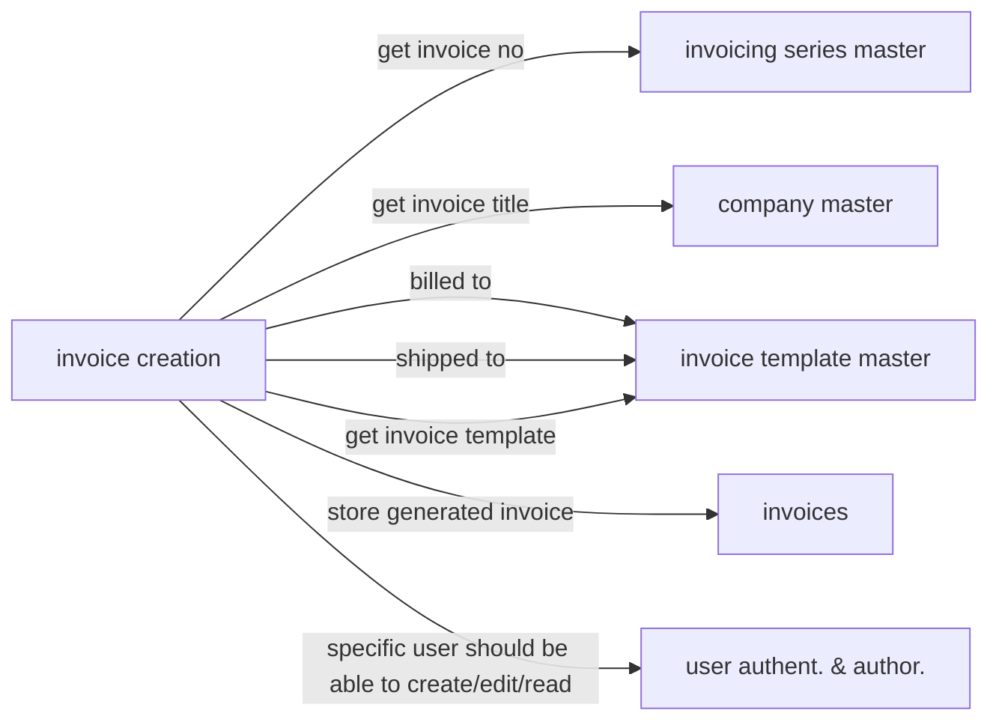

**A new user invoice creation journey**
1. Tenant is to be registered in the system by Aayushya Vajpayee
2. For this Tenant necessary masters need to be created from scratch.
    1. Creation of user for this tenant that can create future users
    2. Registration of currency for this tenant;
3. User of this tenant creates products using api (batch api preferably. Wish we had that).
4. User register invoicing series in invoicing series master.
5. User registers 3-6 supplier business entity and 100-500 customer business entities.
   1. User needs to create address separately. Can we combine both please.Also should there be a unique check on addresses?. Don't think it is required for now
6. User creates invoice by selecting at random products with range 1 to 15.
7. User requests invioce by invoice id
